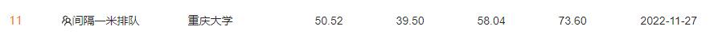

# TransE_Pytorch_OpenBG500
The pytorch implementation of TransE on OpenBG500, knowledge graph link prediction 

随便跑跑mrr41-42左右，调参后mrr45-50, 我的得分（很难复现了）：

比赛链接: https://tianchi.aliyun.com/competition/entrance/532033/introduction

Paper: https://proceedings.neurips.cc/paper/2013/file/1cecc7a77928ca8133fa24680a88d2f9-Paper.pdf

OpenBG500：https://github.com/OpenBGBenchmark/OpenBG500

更高分：可以试试用一些神经网络模型作为embedding层来理解句子的含义，比如TextCNN，TextRNN之类的，应该能上55+，比赛要结束了没时间了，我懒得做了，后面如果有空我再写写吧（估计没空），不要用bert，不行的，根本算不动，120多万条跑到何年何月啊，效果还不一定好。
